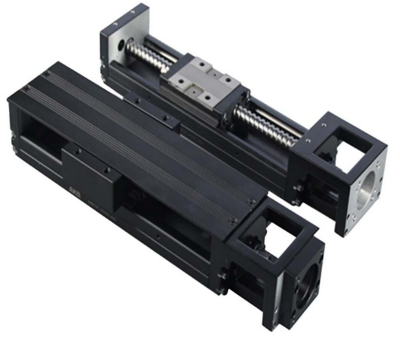
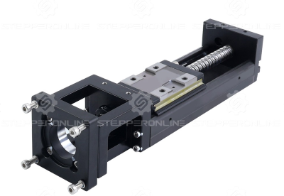
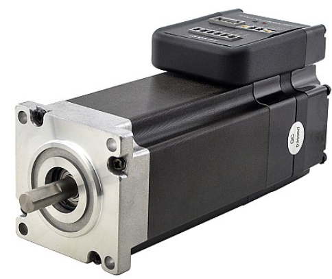
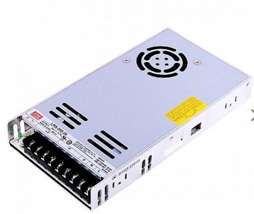
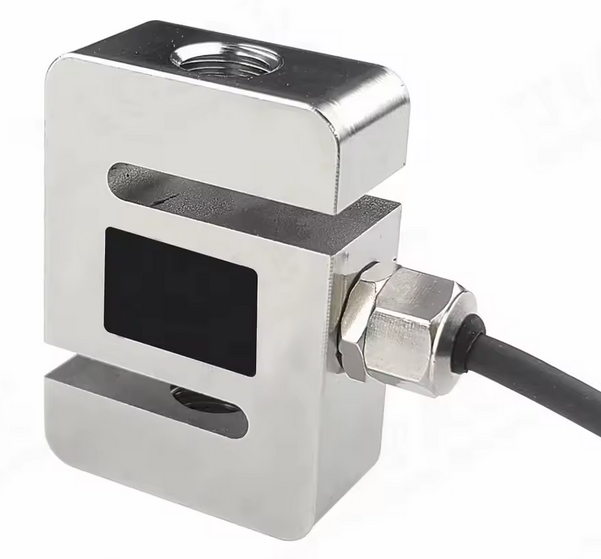

# DIY-Sim-Racing-FFB-Tutorial
A summury of informations for the diy ffb pedal

# Content
[1. Rail](#rail)
[2. Motor](#motor)
[3. PSU](#psu)
[4. Loadcell](#loadcell)

## Parts to order
Apart from the origianl [BOM](https://github.com/ChrGri/DIY-Sim-Racing-FFB-Pedal-Mechanical-Design/tree/main/BOM) i will share the parts i used for my pedal.

### Rail

[JKK60-5-C-150-A1-F4-M](https://jlcmc.com/product/s/B16/BQD-JKK60/steel-linear-actuators-kk60-series)
I would always recomend to order the **JKK rail**. This is much smoother then the normal aliexpress rail. You can search in discord for feedback of the JKK rail.
If you order the rail you have some option to choose. Normaly you can use just the standard **C** option. If you are willing to spend some more money you can order the precision **P** one, but for our application there is no benefit.

[LKN60 KK](https://www.omc-stepperonline.com/lkn60-kk-series-ball-screw-driven-linear-module-max-horizontal-vertical-payload-30kg-10kg-stroke-60mm-lkn60-23dl050-060)
Since some time [stepperonline](https://www.omc-stepperonline.com/) also sell a rail which you can use. It looks like the JKK rail, so i think there are not  much differents. 

### Motor

[iSV57T-130S- NEMA 23 Integrated Easy Servo Motor 130W 3000rpm](https://www.omc-stepperonline.com/nema-23-integrated-easy-servo-motor-130w-3000rpm-0-45nm-63-73oz-in-20-50vdc-servo-motor-short-shaft-isv57t-130s)

This ist the motor for the project. Only the Nema 23 from this side is supported by the firmware. The **iSV57T-130S** is the short shaft version. You can also buy the **iSV57T-130** without the S but you need to shortend the shaft by yourself. 

[iSV57T-180S- NEMA 23 Integrated Easy Servo Motor 180W 3000rpm](https://www.omc-stepperonline.com/nema-23-integrated-easy-servo-motor-180w-3000rpm-0-6nm-84-98oz-in-20-50vdc-servo-motor-short-shaft-isv57t-180s)

Some people use the 180Watt version. This also works, but have in mind that the firmware is tuned for the 130Watt version.

### PSU

[MEANWELL 350W](https://www.omc-stepperonline.com/lrs-350-36-mean-well-350w-36vdc-9-7a-115-230vac-enclosed-switching-power-supply-lrs-350-36)

This is the recomended PSU for 2 pedals. Some guys use it also for 3 pedals. But can not be guaranteed that it has sufficiant power for all game situations.

### Loadcell

[DYLY-107](https://de.aliexpress.com/item/1005003060282833.html)

If you want to build a compact design, i would recommend to with the DYLY-107 loadcell. 

#### Brake Loadcell
It's recomende to use 200kg loadcell for brake. If you are not a havy braker then you also can use a 100kg loadcell.

#### Throttle Loadcell
For throttle a 100kg loadcell should be sufficent even a 50kg should be fine.

